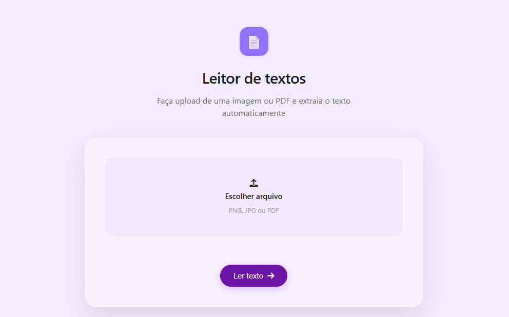
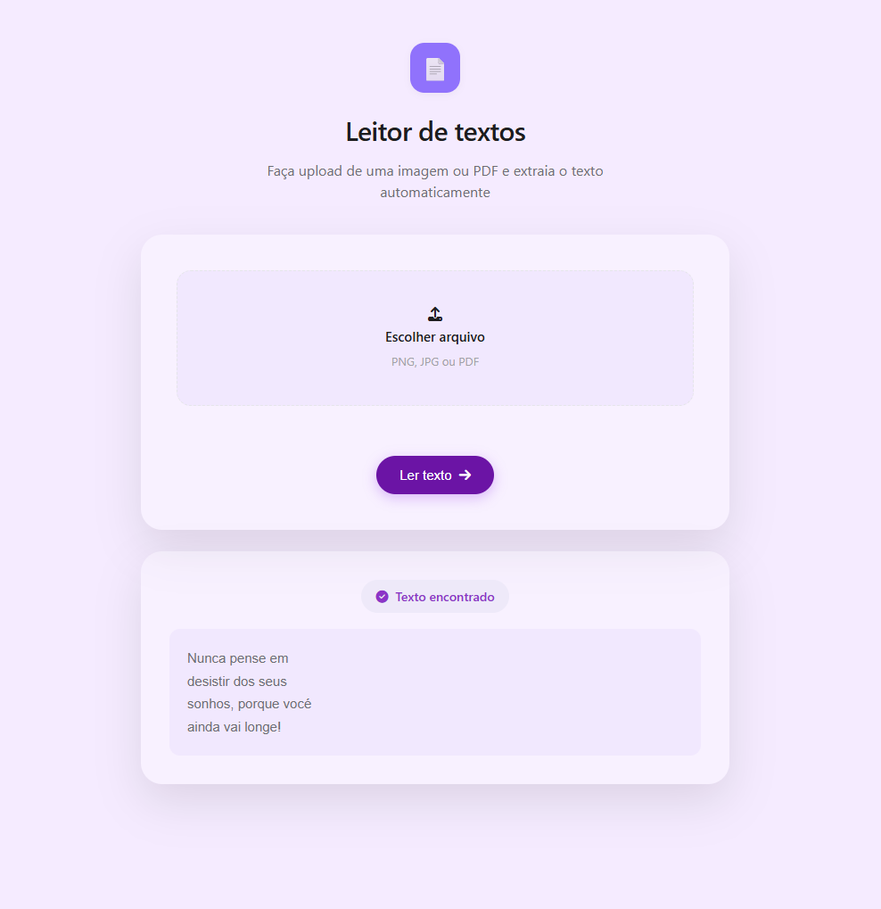

# 🔍 Leitor de Imagens e PDFs com OCR
Projeto desenvolvido para extrair textos de imagens e arquivos PDF utilizando a tecnologia de Reconhecimento Óptico de Caracteres (OCR). 
A aplicação permite que o usuário envie um arquivo por meio de uma interface web e visualize o texto extraído de forma rápida e prática.

## 🎯 Objetivo
O objetivo deste projeto foi colocar em prática conhecimentos de Python, Flask, HTML, CSS e integração entre front-end e back-end, além de explorar a utilização de bibliotecas como o Tesseract OCR para reconhecimento de texto em imagens e documentos.

## 📸 Demonstração 

## 🛠️ Tecnologias utilizadas
    - Python
    - HTML
    - CSS
    - Flask
    - Tesseract OCR
    - Pillow (PIL)
    - Git
    - Poppler

## ✨ Funcionalidade
- Realiza o upload de imagens e PDFs para reconhecimento de texto. 
- Utiliza OCR (Reconhecimento Óptico de Caracteres) para identificar textos presentes nas imagens e documentos.
- Exibe o texto extraído diretamente na interface da aplicação.
- Interface simples e intuitiva para facilitar o uso ao usuário.
- Desenvolvido inicialmente para execução local utilizando Flask.

## ▶️ Como executar
1. Clone o projeto
2. Entre na pasta
3. Instale as bibliotecas e dependências utilizadas
4. Instale e configure o Tesseract OCR em sua máquina
5. Execute o arquivo app.py

## Requisitos para executar PDFs escaneados
1. Para processar PDFs escaneados é necessário instalar o Poppler.
- [Acessar link para instalar - ](https://github.com/oschwartz10612/poppler-windows/releases) 
2. Dentro da pasta procure por "Library --> "bin" e copie o caminho completo. 
Ex.: C:\poppler\Library\bin 

3. Modifique no código "app.py" Ex.: POPPLER_PATH = r"C:\poppler\Library\bin".

## 🚀 Melhorias futuras
- Exportação do texto para arquivo .txt
- Suporte a mais extensões
- Seleção do idioma utilizado pelo OCR

## ​💡​ Sobre
Este projeto foi desenvolvido para fins de estudo e portfólio, com foco em demonstrar conhecimentos em desenvolvimento Python, manipulação de arquivos, utilização de OCR e boas práticas de organização de projetos.

- Autora: Anna Clara - Estudante do 4° semestre de Ciência da Computacão na UNINOVE.

[LinkedIn](https://www.linkedin.com/in/annaxxt/) 
[GitHub](https://github.com/Annaxxt)